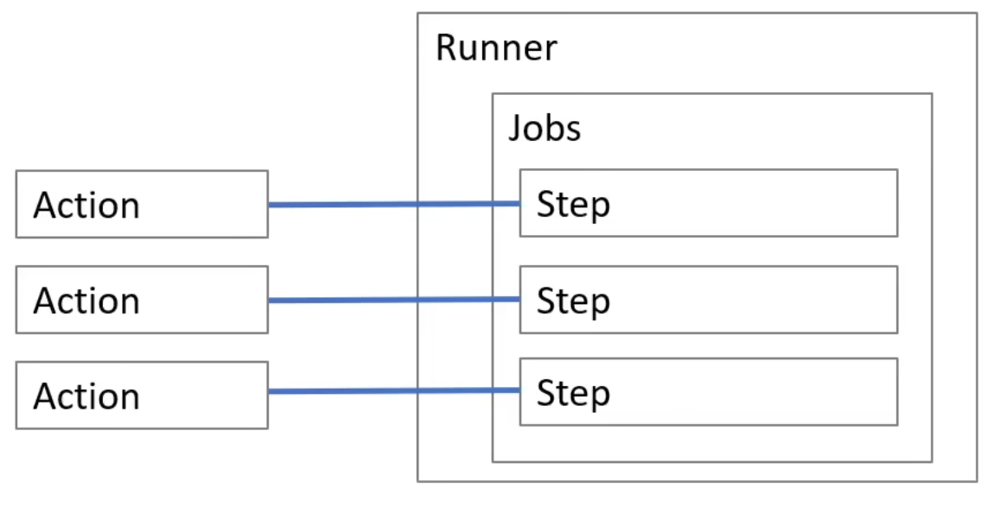

# YAML Terms for GitHub Actions

## Workflow Syntax

Work flow triggers are events that cause a workflow to run:
- Events that occur in your workflow's repository
- Events that occur outside of GitHub and trigger a `repository_dispatch` event on GitHub
- Scheduled times
- Manual

`name` : The name of the GitHub Action

`on` :  When or condition of when the workflow is triggered. There are different filters, branches, labels, that can be used to trigger the workflow.

`jobs` : A jobs runs in a runner environment as determined by `runs-on`

# Course Notes

## Workflow Components

**Actions:** Reusable tasks that perform specific jobs within a workflow

**Workflows:** Automated processes defined in your repository that coordinate one o more jobs, triggered by events or on a schedule

**Jobs:** Groups of steps that execute on the same runner, typically running in parallel unless configured otherwise

**Steps:** Individual tasks within a job that run commands or actions sequentially

**Runs:** Instances of workflow execution triggered by events, representing the complete run-through of a workflow

**Runners:** Servers that host the environment where the jobs are executed, available as GitHub-hosted or self-hosted options

**Marketplace:** A platform to find and share reusable actions



## Scheduling Events

**Schedule** can us a **cron expression** to trigger a workflow at a specific time or day

For example:

```yml
on:
    schedule:
        - cron: '30 5 * * 1,3'
        - cron: '30 5 * * 2,4'

jobs:
    test_schedule:
        runs-on: ubuntu-latest
        steps:
            - name: Not on Monday or Wednesday
            if: github.event.schedule != '30 5 * * 1,3'
            run: echo "Skip this step on Monday and Wednesday"
            - name: Every time
            run: echo "This step will always run"
```

## Triggering Single or Multiple Events

### Single Event

For example on **Push**

```yml
name: CI on Push

on: 
    push:
        branches:
            - main

jobs:
    build:
        runs-on: ubuntu-latest
        steps:
            - uses: actions/checkout@v2
            - name: Run a one-line script
              run: echo "Hello world!"
```

### Multiple Events

For example on **Push, Pull, Request, Release**

Note: If you specify multiple events, only one of those events needs to occur to trigger your workflow. If multiple triggering events for your workflow occur at the same time, multiple workflow runs will be triggered

```yml
name: CI on Multiple Events

on:
    push:
        branches:
            - main
    pull_request:
        branches:
            - main
    release:
        types: [published, created]

jobs:
    build-and-test:
    runs-on: ubuntu-latest
    steps:
        - uses: actions/checkout@v2
        - name: Set up Python
```

### Manual Events

Workflows can be triggered manually through Github UI, GitHub CLI, or GitHub REST API

```
gh workflow run greet.yml \
-f name=brian \
-f greeting=hello \
-F data=@myfile.txt
``` 

a `workflow_dispatch:` and `inputs:` event must be added to run manually